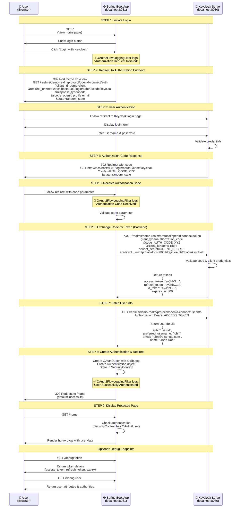

| Flow                          | Who is it for?              | Is user involved?       | Is a browser used? | Security level |
| ----------------------------- | --------------------------- | ----------------------- | ------------------ | -------------- |
| **Authorization Code + PKCE** | Web apps, SPAs, mobile apps | Yes                     | Yes                | ⭐⭐⭐⭐⭐          |
| **Client Credentials**        | Backend → Backend           | No                      | No                 | ⭐⭐⭐⭐           |
| **Device Code**               | TVs, CLIs, IoT              | Yes (on another device) | No                 | ⭐⭐⭐⭐           |
| **Refresh Token flow**        | Long-lived sessions         | No                      | No                 | ⭐⭐⭐⭐⭐          |

# Authorization Code
