| Flow                          | Who is it for?              | Is user involved?       | Is a browser used? | Security level |
| ----------------------------- | --------------------------- | ----------------------- | ------------------ | -------------- |
| **Authorization Code + PKCE** | Web apps, SPAs, mobile apps | Yes                     | Yes                | ⭐⭐⭐⭐⭐          |
| **Client Credentials**        | Backend → Backend           | No                      | No                 | ⭐⭐⭐⭐           |
| **Device Code**               | TVs, CLIs, IoT              | Yes (on another device) | No                 | ⭐⭐⭐⭐           |
| **Refresh Token flow**        | Long-lived sessions         | No                      | No                 | ⭐⭐⭐⭐⭐          |

# Authorization Code

```mermaid
sequenceDiagram
    participant User as 👤 User<br/>(Browser)
    participant App as 🌐 Spring Boot App<br/>(localhost:8081)
    participant Keycloak as 🔐 Keycloak Server<br/>(localhost:8080)

    Note over User,Keycloak: STEP 1: Initiate Login
    User->>App: GET /<br/>(View home page)
    App->>User: Show login button
    User->>App: Click "Login with Keycloak"
    Note over App: 🚀 OAuth2FlowLoggingFilter logs:<br/>"Authorization Request Initiated"
    
    Note over User,Keycloak: STEP 2: Redirect to Authorization Endpoint
    App->>User: 302 Redirect to Keycloak<br/>GET /realms/demo-realm/protocol/openid-connect/auth<br/>?client_id=demo-client<br/>&redirect_uri=http://localhost:8081/login/oauth2/code/keycloak<br/>&response_type=code<br/>&scope=openid profile email<br/>&state=random_state
    
    Note over User,Keycloak: STEP 3: User Authentication
    User->>Keycloak: Follow redirect to Keycloak login page
    Keycloak->>User: Display login form
    User->>Keycloak: Enter username & password
    Keycloak->>Keycloak: Validate credentials
    
    Note over User,Keycloak: STEP 4: Authorization Code Response
    Keycloak->>User: 302 Redirect with code<br/>GET http://localhost:8081/login/oauth2/code/keycloak<br/>?code=AUTH_CODE_XYZ<br/>&state=random_state
    
    Note over User,Keycloak: STEP 5: Receive Authorization Code
    User->>App: Follow redirect with code parameter
    Note over App: 🔄 OAuth2FlowLoggingFilter logs:<br/>"Authorization Code Received"
    App->>App: Validate state parameter
    
    Note over User,Keycloak: STEP 6: Exchange Code for Token (Backend)
    App->>Keycloak: POST /realms/demo-realm/protocol/openid-connect/token<br/>grant_type=authorization_code<br/>&code=AUTH_CODE_XYZ<br/>&client_id=demo-client<br/>&client_secret=CLIENT_SECRET<br/>&redirect_uri=http://localhost:8081/login/oauth2/code/keycloak
    Keycloak->>Keycloak: Validate code & client credentials
    Keycloak->>App: Return tokens<br/>{<br/>  access_token: "eyJhbG...",<br/>  refresh_token: "eyJhbG...",<br/>  id_token: "eyJhbG...",<br/>  expires_in: 300<br/>}
    
    Note over User,Keycloak: STEP 7: Fetch User Info
    App->>Keycloak: GET /realms/demo-realm/protocol/openid-connect/userinfo<br/>Authorization: Bearer ACCESS_TOKEN
    Keycloak->>App: Return user details<br/>{<br/>  sub: "user-id",<br/>  preferred_username: "john",<br/>  email: "john@example.com",<br/>  name: "John Doe"<br/>}
    
    Note over User,Keycloak: STEP 8: Create Authentication & Redirect
    App->>App: Create OAuth2User with attributes<br/>Create Authentication object<br/>Store in SecurityContext
    Note over App: ✅ OAuth2FlowLoggingFilter logs:<br/>"User Successfully Authenticated"
    App->>User: 302 Redirect to /home<br/>(defaultSuccessUrl)
    
    Note over User,Keycloak: STEP 9: Display Protected Page
    User->>App: GET /home
    App->>App: Check authentication<br/>(SecurityContext has OAuth2User)
    App->>User: Render home page with user data
    
    Note over User,Keycloak: Optional: Debug Endpoints
    User->>App: GET /debug/token
    App->>User: Return token details<br/>(access_token, refresh_token, expiry)
    User->>App: GET /debug/user
    App->>User: Return user attributes & authorities
```
